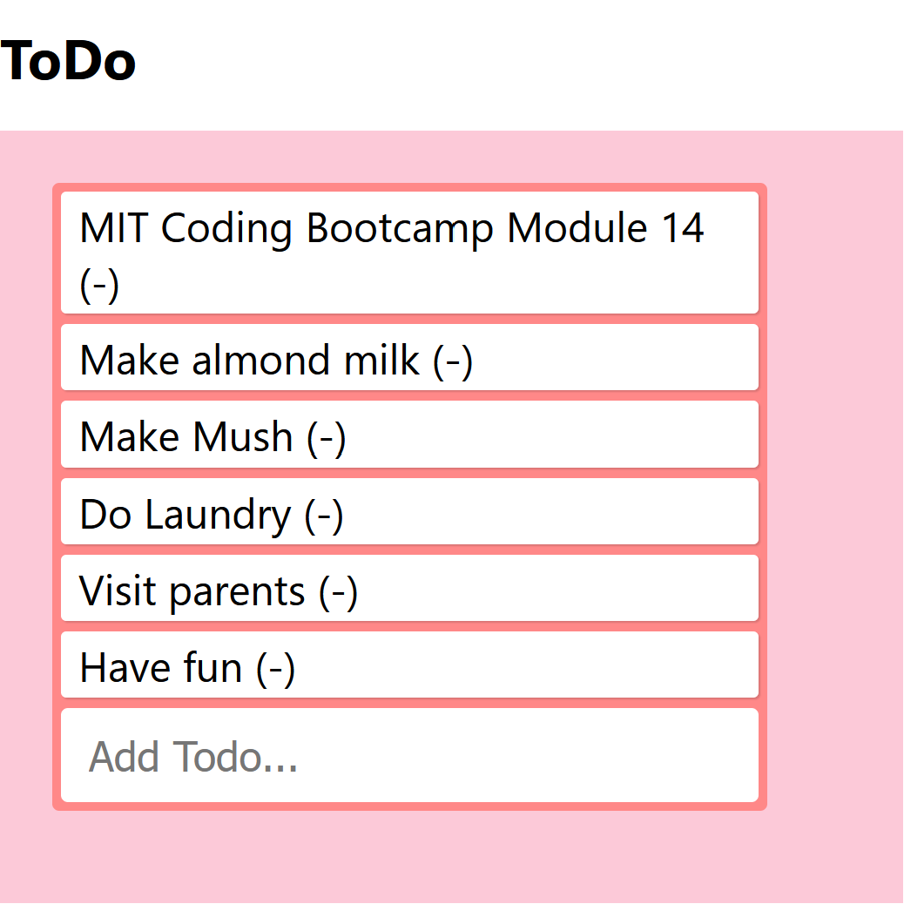

# Style ToDo List

## Description

In this exercise we create and style a ToDo list app. There are a few items already included in lists and user can add new items by typing into the box or remove items by clicking on them.

## How to Run

Save all of the files in this repository to a folder on your computer. If you need to make any changes, you can do so using an editor like vs code. You will need a local server to run this app. Open a blank browser and drag the index over to it. 

## Licenses

MIT License
